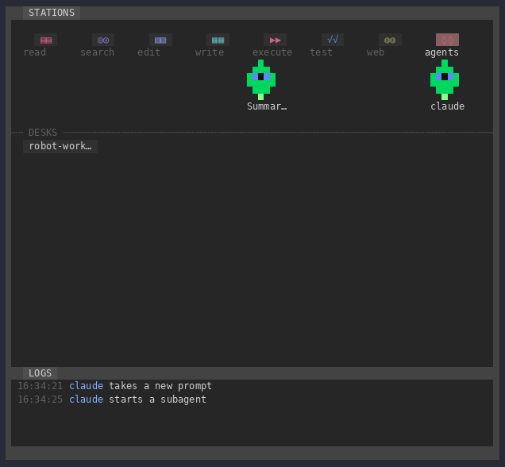

# robot-workers

A pixel-art workshop that shows your coding agents at work. Active Claude Code, GitHub Copilot CLI and OpenCode
sessions on the machine get a desk. The session itself and each visible subagent is a small robot that walks to a
station for the tool it is using, sits down to think, and goes back to its desk when it is done.



## What it shows

- **Stations** along the front: `read`, `search`, `edit`, `write`, `execute`, `test`, `web` and `agents`. A robot walks
  to the station for its current tool call. Shell commands that run a test runner go to `test`.
- **Desks**, one per live session, labelled with the project folder name. Idle and thinking robots sit there, two to a
  seat row. Each session draws its robots in one of nine designs.
- **Message links** between agents that send messages to each other.
- **A log strip** with one plain sentence per recent action, such as "reads main.yml" or "starts a subagent".

## How it works

Each writer publishes a small JSON *beacon* to:

```
${CLAUDE_CONFIG_DIR:-$HOME/.claude}/robot-workers/sessions/<session-id>.json
```

Claude Code and OpenCode refresh their beacons about once a second. Copilot CLI refreshes its beacon when a session,
prompt, tool, error or subagent lifecycle hook fires; with no such event, its beacon becomes stale after 15 seconds.
Each viewer skips stale and ended beacons, then merges the rest into one map. Beacons from other sessions are treated as
untrusted input: every field is checked, capped and cleaned of control characters before it is drawn.

Beacons never carry commands, queries, prompts, message bodies or full paths. The only file information they hold is
the base name of a file being read, searched, edited or written. The folder is mode `0700` and each file is `0600`.
[BEACON.md](BEACON.md) has the full format, for anyone writing another client.

## Usage

The source is at [github.com/konstruktoid/robot-workers](https://github.com/konstruktoid/robot-workers). The OpenCode
and Copilot CLI setups below run from a checkout:

```sh
git clone https://github.com/konstruktoid/robot-workers.git
cd robot-workers
```

### Claude Code

The plugin is a mod, so it needs Claude Code v2.1.287 or later (`claude --version`).

The repository is its own marketplace. Add it once and install from it:

```sh
claude plugin marketplace add konstruktoid/robot-workers
claude plugin install robot-workers@robot-workers
```

To install from a local checkout instead, pass its path: `claude plugin marketplace add /path/to/robot-workers`.

`claude plugin update robot-workers@robot-workers` picks up a new release.

To load it for one session without installing, use `claude --plugin-dir /path/to/robot-workers`. To load an
uninstalled checkout in every session, do either of these:

- Put the absolute path in `CLAUDE_CODE_PLUGIN_DIRS` (Claude Code v2.1.280 or later).
- Link the folder into your personal skills directory: `ln -s /path/to/robot-workers ~/.claude/skills/robot-workers`.

After editing the plugin's files, run `/reload-plugins` in the session.

The **Workshop** pane opens when the session starts. Run `/workers` to open it again. On surfaces that cannot draw the
pixel map, the pane shows a text list of agents and what each one is doing instead.

To see robots from more than one session, start each of them with the plugin loaded.

Headless sessions with the plugin enabled, such as `claude -p` and Agent SDK runs, draw no pane but still write a
beacon, so they get a desk on the maps of interactive sessions.

#### What the mod does on your machine

`claude plugin validate .` lists every API call the mod makes. Each one is used for this:

- `$.process.run`: once per session start, runs the shipped script `bin/beacon-dir.sh` by its fixed path under the
  plugin folder, with the session id as its only argument. It creates the beacon folder, refuses it if it is relative,
  a symlink or owned by someone else, sets modes `0700` and `0600`, deletes beacons untouched for a day, and prints the
  folder path. The only programs it starts are `mkdir`, `chmod` and `find`; `umask`, `case`, `[`, `:` and `printf`
  are shell built-ins. A script is needed because `$.fs.write` cannot set a file mode. It is the only program the mod
  starts, and it opens no network connection.

- `$.fs.write`, `$.fs.list`, `$.fs.read`: only inside that folder. The mod writes one file,
  `${CLAUDE_CONFIG_DIR:-$HOME/.claude}/robot-workers/sessions/<session-id>.json`, in the format in
  [BEACON.md](BEACON.md). No build, start-up, settings or instructions file is written, and no tool runs or obeys
  the beacons; other robot-workers viewers only draw them.
- `$.agent.list`, `$.session.id`, `$.session.root`: the session's own agents, id and folder name.
- `$.clock.every`, `$.state.*`, `$.ui.*`, `$.command.register`: the once-a-second tick, map state, the pane and
  `/workers`.

Hooks:

- `tool.call`: records the tool name and its target, then returns `next(e)` unchanged. It never blocks, rewrites or
  answers a call. The target (a file path, or the first 40 characters of a shell command) is kept only in this
  session's own pane state; beacons carry at most a file's base name.
- `turn.start`, `turn.step`, `turn.complete`, `session.start`, `session.end`, `command.run`, `ui.render`: drive the
  robots' poses, the log strip, the pane, the beacon lifecycle and `/workers`.
- The mod has no `tool.check` or permission hook and makes no permission decision.

What it reads and sends:

- `CLAUDE_CONFIG_DIR` and `HOME` are read only to locate the beacon folder. The mod reads no token, API key or other
  credential, and no `user_config` value is needed.
- It sends nothing off the machine: no network requests, no model calls. The beacon is a local file. The host names
  in this README and in `BEACON.md` (github.com, opencode.ai) are documentation links, and `x.test` in
  `hooks/security.test.ts` is a reserved test domain used as hostile input.
- `DENIED_KEYS` in `hooks/scene.ts` lists `__proto__`, `constructor` and `prototype` so that beacons from other
  sessions, parsed as untrusted JSON, cannot pollute object prototypes. Those keys are dropped, never looked up.

It adds no skills, agents or MCP servers, so it costs no context tokens.

### OpenCode

OpenCode needs two separate plugins, because it loads server and TUI plugins from different places.

1. From the checkout, link the beacon writer into OpenCode's global plugin folder:

   ```sh
   mkdir -p ~/.config/opencode/plugins
   ln -s /path/to/robot-workers/opencode/robot-workers.ts ~/.config/opencode/plugins/robot-workers.ts
   ```

   OpenCode also loads the older singular folder, `~/.config/opencode/plugin/`. Use one of the two, not both.

2. Add the workshop view to the `plugin` array in `~/.config/opencode/tui.json`, using the checkout's absolute path:

   ```json
   { "$schema": "https://opencode.ai/tui.json", "plugin": ["file:///path/to/robot-workers/opencode/workshop.tsx"] }
   ```

Restart OpenCode. The workshop then appears in the session sidebar, below Context. `/workshop` hides or shows it. It
only reads beacons, so it shows Claude Code, Copilot CLI and OpenCode sessions.

### GitHub Copilot CLI

Copilot CLI writes beacons through its user-level hooks. Install the hooks from this checkout once:

```sh
node copilot/install.mjs
```

This writes `robot-workers.json` under `${COPILOT_HOME:-$HOME/.copilot}/hooks/`. Each hook runs the `node` that ran the
installer, by absolute path, on this checkout's `copilot/robot-workers.mjs`. It replaces an existing
`robot-workers.json` in that directory. Run the installer with the same `COPILOT_HOME` that Copilot CLI uses. Restart
Copilot CLI after installing, and rerun the installer if the checkout or that Node installation moves. Active Copilot
sessions and subagents that emit Copilot lifecycle events then appear in the existing Claude Code Workshop and OpenCode
sidebar maps.

The hook observes session, prompt, tool, error and subagent lifecycle events. It returns `{}` to Copilot for every
event, so it cannot change permission or tool decisions. Like the other writers, it stores no prompts, commands, tool
results, error details, full paths, URLs or subagent responses in a beacon. File actions share only a sanitized base
name.

## Repository layout

| Path | Contents |
| --- | --- |
| `.claude-plugin/plugin.json` | Claude Code plugin manifest |
| `.claude-plugin/marketplace.json` | Marketplace listing for `claude plugin marketplace add` |
| `hooks/hooks.json` | Lists `hooks/register.tsx` as the mod's module |
| `hooks/register.tsx` | Claude Code side: event hooks, beacon writing and reading, the Workshop pane |
| `bin/beacon-dir.sh` | Creates the private beacon folder and file at session start |
| `hooks/scene.ts` | Shared, side-effect-free code: beacon parsing, layout, robot designs, pixel painting |
| `hooks/*.test.ts` | Claude Code plugin tests |
| `opencode/robot-workers.ts` | OpenCode beacon writer (server plugin) |
| `opencode/workshop.tsx`, `opencode/frame.ts` | OpenCode sidebar view (TUI plugin) |
| `opencode/*.node-test.ts` | opencode-side tests for `node:test` |
| `copilot/robot-workers.mjs` | GitHub Copilot CLI beacon writer (hook command) |
| `copilot/install.mjs` | Installs the Copilot user-level hook configuration |
| `copilot/*.node-test.mjs` | Copilot hook tests for `node:test` |
| `types/index.d.ts` | `World`, `Activity` and `Beacon` types |
| `BEACON.md` | Beacon file format |

## Development

```sh
claude plugin validate --strict . && claude plugin test .
```

Each release increments `version` in `.claude-plugin/plugin.json`. Without the bump, `claude plugin update` keeps
users on the old copy.

The pixel map is drawn by Claude Code and OpenCode. Copilot CLI contributes event-recent sessions to those existing maps
through hooks; it does not add a pane to Copilot CLI itself.

`claude plugin test` runs every `hooks/*.test.ts`. The OpenCode tests use the `.node-test.ts` suffix so that
`claude plugin test` skips them. Run them with a Node build that supports TypeScript type stripping, or transpile them
to `.mjs` first:

```sh
node --test opencode/*.node-test.ts
```

Run the Copilot hook tests with:

```sh
node --test copilot/robot-workers.node-test.mjs
```

`isTestCommand` exists in both `hooks/scene.ts` and `opencode/robot-workers.ts`. Change both copies together.

## License

Copyright 2026 Thomas Sjögren. Licensed under the [Apache License, Version 2.0](LICENSE).
